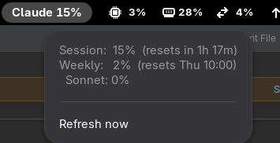

# Claude Rate Limit Monitor



A GNOME Shell top-bar extension that shows Claude rate-limit / usage. Works in
two modes so it's useful regardless of how you access Claude.

## Modes

Edit `~/.config/claude-monitor/config.json`:

```json
{
  "mode": "subscription",        // or "api"
  "panel_metric": "max",         // max | session | week | week_sonnet
  "api_key_env": "ANTHROPIC_API_KEY",
  "model": "claude-haiku-4-5"
}
```

### `subscription` mode (Pro/Max) — default
Reads the same endpoint the web UI's "Plan usage limits" panel and Claude Code's
`/usage` command use:

```
GET https://api.anthropic.com/api/oauth/usage
Authorization: Bearer <Claude Code OAuth token>
anthropic-beta: oauth-2025-04-20
```

The token comes from `~/.claude/.credentials.json` (created when you log into
Claude Code). The response gives utilization percentages and reset times:

- `five_hour`        → "Session" (the rolling 5-hour window)
- `seven_day`        → "Weekly" (all models)
- `seven_day_sonnet` / `seven_day_opus` → per-model weekly windows

The helper auto-refreshes the OAuth token (via `/v1/oauth/token`) when it's
within 5 minutes of expiry and writes the new token back atomically, so the
monitor keeps working without you re-running Claude Code.

`panel_metric` chooses which number the top bar shows: `max` (default, the
most-constrained window — safest), `session`, `week`, or `week_sonnet`.

> ⚠️ `/api/oauth/usage` is **undocumented** — Anthropic can change or remove it
> at any time. There is no official public API for subscription limits.

### `api` mode (API key + billing)
Makes one minimal `POST /v1/messages` request each poll and reads the
`anthropic-ratelimit-*` response headers (requests/tokens/input/output limits +
remaining). There is **no** "get my limits" GET endpoint, so it reads them off a
real call — that bills a few tokens per poll, so raise `REFRESH_SECONDS` in
`extension.js` if you use this mode.

**Environment gotcha:** GNOME Shell spawns the helper *without* your shell's
environment, so `ANTHROPIC_API_KEY` from `.bashrc`/`.zshrc` won't be visible.
Put it where the systemd user session (and thus gnome-shell) will see it:

```
mkdir -p ~/.config/environment.d
printf 'ANTHROPIC_API_KEY=sk-ant-...\n' > ~/.config/environment.d/claude.conf
# then log out and back in
```

## Install

The files live in:
`~/.local/share/gnome-shell/extensions/claude-monitor@nandork.github.io/`

Enable it:
```
gnome-extensions enable claude-monitor@nandork.github.io
```

On **Wayland** you must **log out and back in** after installing or editing
(you can't restart gnome-shell in place). After that, toggling enable/disable
is instant.

## Debugging

```
# Run the helper directly:
python3 ~/.local/share/gnome-shell/extensions/claude-monitor@nandork.github.io/helper.py

# Watch shell logs for extension errors:
journalctl --user -f -o cat /usr/bin/gnome-shell
```

## Sharing

To publish on extensions.gnome.org, zip the extension directory contents (not
the parent folder) and upload. The `helper.py` ships inside the extension, so
end users only need Python 3 (stdlib only — no pip installs).
